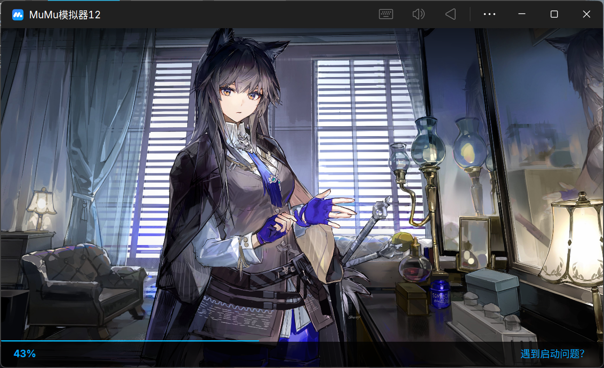
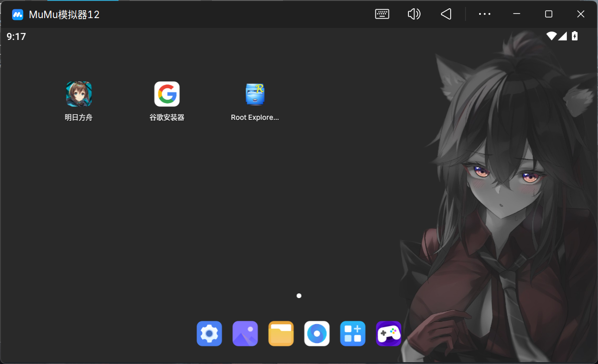

# fuckMuMu
干掉MuMu模拟器 v5+ 的所有广告，包括但不限于开屏广告、桌面广告等

## 去除开屏广告

1. 下载 `fuckStartupAD.py`并运行

2. 在终端中粘贴 MuMu 模拟器用户目录，一般为`%APPDATA%\Netease\MuMuPlayer\data`

3. 在终端中粘贴想要替换的开屏照片目录，必须为**jpeg或jpg**格式，目前暂且仅支持单张照片

4. Enjoy it!

## 去除桌面广告 （需要WSL）

1. 安装guestfs
```
# Ubuntu/Debian
sudo apt-get install libguestfs-dev libguestfs-tools python3-dev
# CentOS/RHEL
sudo yum install libguestfs-devel python3-devel
# ArchLinux
sudo pacman -S libguestfs
```

2. 在终端中输入vdi所在位置，一般为`\Program Files\Netease\MuMu Player 12\nx_device\12.0\vms\MuMuPlayer-12.0-base\system.vdi`

3. Enjoy it!

## 预览

### <div align='center'>Startup</div>

<p align='center'>


### <div align='center'>Desktop</div>
<p align='center'>


## TODO

1. 找到其他不需要WSL的方案去掉桌面广告

2. 让`fuckStartupAD.py`支持多照片

## 感谢
https://www.bilibili.com/opus/830791956620640309 by 飞小RAN

还有我自己！
